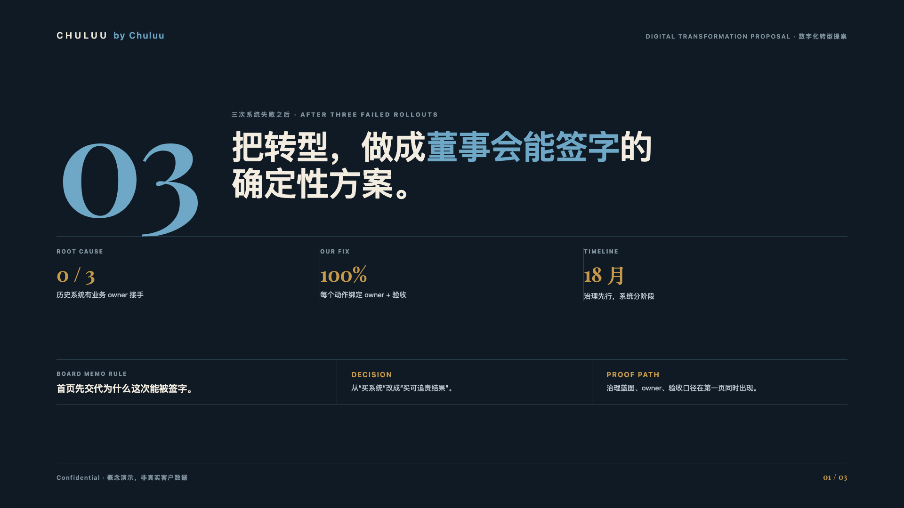
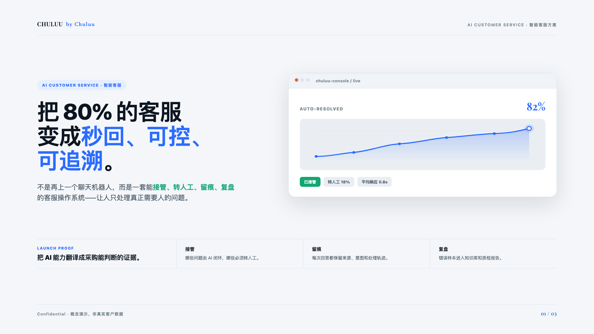
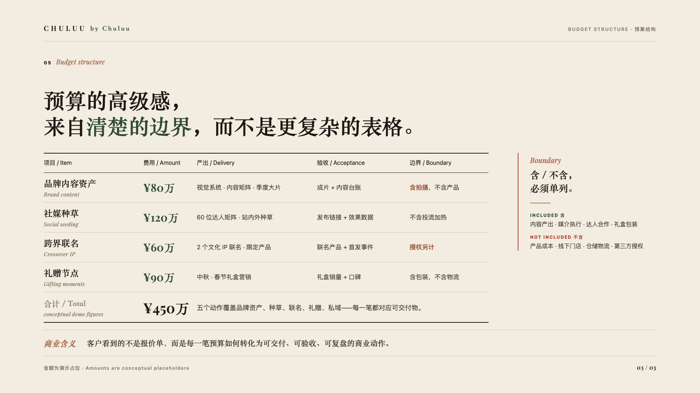

# proposal-ppt-skill

> **The proposal-writing brain that wins pitches — and it also produces the deck.**
> An open-source AI agent skill that turns briefs, tenders, research, budgets, and cases into a *winning argument first*: a sharp winning thesis, proof-anchored slides, an editable `.pptx`, and a presenter script. Most AI tools make slides prettier; this one decides **why the proposal should win**, then builds the deck.

[Simplified Chinese](./README.zh-CN.md) | English

[](./SKILL.md)
[](./skill.json)
[](./LICENSE)
[](./scripts/audit_proposal_pptx.py)
[](./references/workflow.md)

### Demo

<table>
<tr>
<td width="33%">
<a href="https://raw.githack.com/ChuluuMGL/proposal-ppt-skill/main/docs/demo/premium-boardroom-demo.html"></a><br/>
<b>premium-boardroom</b><br/>
Strict grid, board-document clarity, high-trust proof pages.<br/>
<a href="https://raw.githack.com/ChuluuMGL/proposal-ppt-skill/main/docs/demo/premium-boardroom-demo.html">Open HTML demo</a>
</td>
<td width="33%">
<a href="https://raw.githack.com/ChuluuMGL/proposal-ppt-skill/main/docs/demo/editorial-brand-demo.html"></a><br/>
<b>editorial-brand</b><br/>
Magazine-like typography, editorial rhythm, premium consumer tone.<br/>
<a href="https://raw.githack.com/ChuluuMGL/proposal-ppt-skill/main/docs/demo/editorial-brand-demo.html">Open HTML demo</a>
</td>
<td width="33%">
<a href="https://raw.githack.com/ChuluuMGL/proposal-ppt-skill/main/docs/demo/tech-launch-demo.html"></a><br/>
<b>tech-launch</b><br/>
Product/interface hero, launch clarity, KPI and acceptance proof.<br/>
<a href="https://raw.githack.com/ChuluuMGL/proposal-ppt-skill/main/docs/demo/tech-launch-demo.html">Open HTML demo</a>
</td>
</tr>
</table>

> The HTML demos are committed under [`docs/demo/`](./docs/demo). GitHub does not render repository HTML files directly inside README, so the preview links use RawGitHack. Real client photography is replaced with conceptual visuals; final `.pptx` fidelity depends on the host runtime's presentation backend.

**Proof-dense page example**



### Why this skill, not another "pretty slides" tool

Pitches are won on the **argument**, not the decoration. A beautiful deck with a weak thesis loses to a plain deck with a sharp one — but a plain deck never gets read. So this skill optimizes for the part that actually wins (the **winning thesis**, proof objects, budget boundaries, and risk removal) and treats premium design as the *permission to be heard*, not the product.

It is **anti-fabrication by design**: it never invents data, cases, pricing, awards, or permissions, and it never claims a PowerPoint was delivered when only markdown, HTML, or a PDF exists. Deliverables are also **objectively auditable** — see [Objective QA](#objective-qa-dont-trust-verify).

### What you get

`proposal-ppt` turns messy proposal inputs into a structured commercial proposal package:

| Output | What It Contains |
|---|---|
| Editable `.pptx` | A business proposal deck with a coherent storyline, slide-by-slide proof objects, visual system, and QA-ready layout. |
| Presenter script `.md` | The proposal logic, section rhythm, slide-by-slide talk track, transition lines, and assumptions to confirm. |
| Missing-information list | A clear list of unknowns that should be marked instead of invented. |
| Style and asset plan | Optional rich style system, font pairing, asset plan, and AI-image/HTML/SVG background route when needed. |

### Table of contents

[Use cases](#use-cases) · [Workflow](#workflow) · [Objective QA](#objective-qa-dont-trust-verify) · [Work modes](#work-modes) · [Style template families](#style-template-families) · [Rich style workflow](#rich-style-workflow) · [Proposal routes](#proposal-routes) · [Runtime compatibility](#runtime-compatibility) · [Installation](#installation) · [Recommended prompts](#recommended-prompts) · [Design principles](#design-principles) · [FAQ](#faq) · [Included files](#included-files) · [Related skills](#related-skills)

---

## Use Cases

| Scenario | Typical Request |
|---|---|
| Business proposal deck | "Create a proposal PPT from this client brief." |
| Bid / RFP / tender presentation | "Turn this tender document into a pitch deck and script." |
| Annual operation plan | "Create an annual social/content operation proposal." |
| Brand and social marketing proposal | "Build a brand campaign or social media proposal deck." |
| Live commerce / event / activation plan | "Create an execution proposal with budget, SOP, risk, and KPI." |
| AI / SaaS / digital consulting proposal | "Create a solution deck with roadmap, architecture, and value model." |
| Partnership / sponsorship proposal | "Create a cooperation proposal with packages and activation scenarios." |
| Existing deck revision | "Improve this PPT's logic, titles, proof objects, and presenter script." |

---

## Workflow

This skill uses a stage-gated workflow inspired by professional proposal production:

| Stage | Gate | Deliverable |
|---|---|---|
| 0. Start and route | Choose mode, proposal type, depth, visual source, and deliverables. | Startup judgment |
| 1. Brief intake | Separate confirmed facts from missing information. | Brief audit |
| 2. Proposal blueprint | Build the winning thesis, chapter flow, page plan, and proof objects. | Blueprint for approval |
| 3. Slide copy | Write concise slide copy and proof-object content. | Slide-level copy draft |
| 4. PPT build | Create or edit the PowerPoint deck. | Editable `.pptx` |
| 5. Presenter script | Write the proposal logic and slide-by-slide talk track. | `.md` script |
| 6. Final QA | Check logic, evidence, visual layout, budget, KPI, and risk. | Delivery-ready package |

Default mode is `guided`: the agent stops after the blueprint and waits for confirmation before building the PPTX. If you ask it to proceed directly, it uses `auto` mode and marks missing information as "to be confirmed."

---

## Objective QA — don't trust, verify

Deliverables are checked by an objective script, not only the agent's self-assessment. [`scripts/audit_proposal_pptx.py`](./scripts/audit_proposal_pptx.py) verifies a finished deck **without the agent in the loop**:

- the `.pptx` is a valid Office Open XML package (zip + `[Content_Types].xml`);
- actual slide count (and warns when a deck is too thin);
- placeholder leakage (`待补充` / `TODO` / `TBC` / `lorem ipsum` / …) that should not survive into a shipped deck;
- presenter-notes coverage and slide-count alignment against the `.md` script;
- oversized empty "dead frame" regions (when `python-pptx` is available).

```bash
# audit a delivered deck against its presenter script
python3 scripts/audit_proposal_pptx.py outputs/proposal.pptx --script outputs/proposal.md

# audit the bundled blank template (fill-in markers are allowed)
python3 scripts/audit_proposal_pptx.py assets/minimal-proposal-template.pptx --template
```

Pure standard library (`zipfile` + `xml`); `python-pptx` is optional and unlocks the deeper blank-frame checks. This closes the loop on the skill's *"do not claim a PPTX was delivered when it was not"* Hard Rule.

---

## Work Modes

| Mode | When to Use | Behavior |
|---|---|---|
| `guided` | You want to review the strategy before slides are built. | Produces the audit and blueprint first, then waits for confirmation. |
| `auto` | You need a complete first draft quickly. | Builds the full PPTX and script with assumptions clearly marked. |
| `edit` | You already have a PPTX. | Preserves the deck's visual system unless you ask for a redesign. |
| `audit` | You only want review feedback. | Reviews the deck and returns findings, risks, and revision suggestions. |

---

## Rich Style Workflow

If you ask for a strong direction such as pixel retro, fashion editorial, launch minimal, Japanese minimal, Japanese magazine collage, oil salon, or Web3/AI glass, the skill should not merely repaint a generic template.

It first defines the Style DNA and prefers a three-page sample gate:

| Sample | Purpose | What It Checks |
|---|---|---|
| Cover / big-idea page | Tests the visual peak of the style. | The style is recognizable without reading the style name. |
| Proof / mechanism page | Tests whether the style can carry commercial evidence. | Proof objects change component form, not only color. |
| Dense business page | Tests budget, KPI, risk, timeline, or brief-coverage readability. | The style does not sacrifice legibility or acceptance boundaries. |

If a style only works for cover or divider pages, the skill restricts it to expressive pages. Budget, KPI, risk, and brief-coverage pages return to clearer business structures.

Included style systems include `fashion-beauty-editorial`, `beauty-gloss-clinical`, `japanese-minimal`, `japanese-magazine-collage`, `cinematic-photography`, `web3-ai-glass`, `pixel-retro`, `oil-salon`, `french-editorial`, `american-campaign-bold`, `craft-paper-natural`, and `e-reader-mono`.

---

## Runtime Compatibility

This skill is not a standalone PPTX rendering engine. It provides proposal strategy, page planning, visual systems, presenter scripts, and QA gates. Direct editable `.pptx` generation depends on the host agent's presentation backend.

| Status | Runtime / Agent | Notes |
|---|---|---|
| tested | Claude Code | User-tested with a local proposal-generation flow in 2026-06. PPTX output still depends on host tooling. |
| tested | Codex / OpenAI coding agent | Repository editing, validation, publishing, and local PPTX style-demo generation were validated in Codex. |
| expected | Generic `SKILL.md` readers | Expected when the agent can read local skill folders and referenced markdown files. |
| expected, unverified | Cursor / Windsurf / Trae / Qoder / Antigravity / OpenClaw / Hermes | Expected as instruction packs, but not maintainer-verified. Validate invocation, file access, and PPTX backend before auto mode. |

See [`references/runtime-compatibility.md`](./references/runtime-compatibility.md) for the full matrix.

Editable `.pptx` generation requires at least one backend: host presentation skill/tooling, `python-pptx`, `pptxgenjs`, an Office-compatible exporter, PowerPoint / Keynote / LibreOffice automation, or an equivalent runtime-specific tool.

If the current runtime has no PPTX backend, the skill should downgrade to a proposal blueprint, slide-by-slide copy, visual specification, and presenter script instead of pretending a PowerPoint file was created.

---

## Proposal Routes

The skill does not force every proposal into the same template. It routes the project into one primary proposal type:

| Route | Best For |
|---|---|
| Brand, social, and content marketing | Brand campaigns, social operation, creative concepts, content systems. |
| Annual operation and retainer service | Always-on operations, account management, B2B content assets, customer operations. |
| Project execution, live commerce, and activation | Live commerce, event execution, production-heavy work, complex project delivery. |
| Consulting, digital, AI, SaaS, and tooling | Transformation, AI tools, SaaS platforms, workflow automation, consulting proposals. |
| Partnership, sponsorship, and resource integration | Sponsorship, channel cooperation, joint marketing, investment packages. |

See [`references/proposal-routes.md`](./references/proposal-routes.md) for the full routing logic.

---

## Style Template Families

When no client visual identity or reference deck is provided, the skill routes visual design into four public template families instead of repainting the same fallback deck:

| Template Family | Best For | Visual Logic |
|---|---|---|
| `premium-boardroom` | B2B, consulting, finance, tenders, annual retainers | Strict grid, board-document clarity, high-trust proof pages. |
| `editorial-brand` | Brand marketing, fashion, beauty, premium consumer, hospitality | Image-led or typography-led editorial spreads with business captions. |
| `tech-launch` | AI, SaaS, product launch, fintech, technical proposals | Keynote-like focus, product/interface heroes, clear system diagrams. |
| `lifestyle-commerce` | FMCG, food/beverage, retail, creator/content/social commerce | Product scenes, catalog proof walls, execution samples, commerce clarity. |

New style routes must pass a three-page sample gate before scaling to a full deck:

1. cover or big-idea page,
2. strategy or mechanism page,
3. proof-dense page such as budget, KPI, risk, timeline, or brief coverage.

See [`references/style-template-strategy.md`](./references/style-template-strategy.md).

---

## Included Files

| File / Folder | Purpose |
|---|---|
| [`SKILL.md`](./SKILL.md) | Core skill metadata and instructions. |
| [`references/workflow.md`](./references/workflow.md) | Guided workflow, stage gates, recommended prompts. |
| [`references/proposal-routes.md`](./references/proposal-routes.md) | Proposal type routing and chapter structures. |
| [`references/page-types.md`](./references/page-types.md) | Page-type library and proof-object standards. |
| [`references/layout-rhythm.md`](./references/layout-rhythm.md) | Slide density, whitespace balance, and deck pacing rules. |
| [`references/visual-system.md`](./references/visual-system.md) | Visual families, typography, layout, chart, and screenshot rules. |
| [`references/palette-library.md`](./references/palette-library.md) | Default high-taste palette presets when no client visual identity exists. |
| [`references/style-template-strategy.md`](./references/style-template-strategy.md) | Four public style-template families, Style DNA contract, and three-page sample gate. |
| [`references/style-systems.md`](./references/style-systems.md) | Secondary component transformations such as Swiss, launch minimal, beauty editorial, Japanese minimal, collage, cinematic, Web3/AI glass, pixel, and oil. |
| [`references/asset-pipeline.md`](./references/asset-pipeline.md) | User assets, AI-generated visuals, HTML/SVG backgrounds, and image QA rules. |
| [`references/font-system.md`](./references/font-system.md) | Free/commercial-safe font pairings and fallbacks. |
| [`references/output-contract.md`](./references/output-contract.md) | Required PPTX and presenter-script output format. |
| [`references/runtime-compatibility.md`](./references/runtime-compatibility.md) | Agent compatibility, PPTX backend requirements, and fallback modes. |
| [`references/quality-check.md`](./references/quality-check.md) | Final QA checklist and common failure modes. |
| [`references/frontend-slides-audit.md`](./references/frontend-slides-audit.md) | Practices borrowed from the `frontend-slides` project (visual discovery, fixed 16:9 stage, density modes). |
| [`scripts/audit_proposal_pptx.py`](./scripts/audit_proposal_pptx.py) | Objective delivery QA — validates the pptx, slide count, placeholder leakage, and script alignment. |
| [`assets/minimal-proposal-template.pptx`](./assets/minimal-proposal-template.pptx) | Neutral fallback PowerPoint template. |
| [`assets/demo/`](./assets/demo) | Rendered concept-demo images of the three style families (shown at the top). |
| [`agents/openai.yaml`](./agents/openai.yaml) | Codex/OpenAI-style skill UI metadata. |
| [`skill.json`](./skill.json) | Machine-readable metadata for directories and marketplaces. |

The fallback template is used only when there is no client visual identity, no reference deck, and no stronger design direction.

---

## Installation

### Ask an AI Agent

You can ask your AI coding agent:

> Install the proposal-ppt skill from https://github.com/ChuluuMGL/proposal-ppt-skill

### Manual Install

| Agent / IDE | Suggested Skill Directory |
|---|---|
| Codex | `~/.codex/skills/proposal-ppt/` |
| Claude Code | `.claude/skills/proposal-ppt/` |
| Cursor | `.cursor/skills/proposal-ppt/` |
| Qoder | `.qoder/skills/proposal-ppt/` |
| Trae | `.trae/skills/proposal-ppt/` |
| Windsurf | `.windsurf/skills/proposal-ppt/` |
| Generic agents | `.agents/skills/proposal-ppt/` |

Example:

```bash
git clone https://github.com/ChuluuMGL/proposal-ppt-skill.git \
  ~/.codex/skills/proposal-ppt
```

Restart your agent after installation so the skill metadata is reloaded.

---

## Recommended Prompts

### Guided Blueprint First

```text
Use $proposal-ppt to create a business proposal from the brief below.

Do not generate the PPTX yet. First return:
1. Brief audit
2. Winning thesis
3. Chapter structure
4. Slide-by-slide titles, page purpose, and proof object
5. Visual system recommendation
6. Questions that need my confirmation

Brief:
...
```

### Direct PPTX and Presenter Script

```text
Use $proposal-ppt to directly generate:
1. an editable PowerPoint deck
2. a same-name presenter script in Markdown

Requirements:
- infer the proposal route and slide count
- mark missing information as to be confirmed
- do not invent data, cases, pricing, or performance results
- use the fallback business template if no client visual identity is available
- save outputs to the current project's outputs folder

Brief:
...
```

### Style-Rich Proposal

```text
Use $proposal-ppt in guided mode to create a style-rich business proposal.

Before generating PPTX, recommend:
1. proposal route and winning thesis
2. template family from style-template-strategy.md
3. Style DNA and three-page sample gate
4. font pairing and fallback
5. visual asset plan, including user assets vs AI-generated conceptual assets
6. page types that should stay business-clean

Visual direction:
premium-boardroom / editorial-brand / tech-launch / lifestyle-commerce

Brief:
...
```

### Existing Deck Revision

```text
Use $proposal-ppt to revise this existing proposal PPTX.

Goals:
- preserve the current visual style
- improve the winning thesis and chapter logic
- convert slide titles into conclusion sentences
- add proof-object recommendations
- output a matching presenter script in Markdown

File:
...
```

---

## Design Principles

- Start from the client's business problem, not the vendor's service list.
- Every slide should make one judgment and show one proof object.
- Use conclusion-style slide titles.
- Put reasoning and oral explanation into the presenter script, not dense slide text.
- Do not invent data, cases, awards, platform permissions, pricing, or performance results.
- Mark unknowns clearly instead of hiding them.
- Make budget, KPI, ownership, acceptance criteria, and risk boundaries visible.

---

## FAQ

**Is this a PowerPoint template or an AI skill?**  
It is an AI skill. The included PPTX is only a neutral fallback template. The main value is the workflow, page planning, proof-object logic, and presenter-script structure.

**Does it create the PPTX automatically?**  
Yes, when used inside an agent that can create or edit PowerPoint files, such as a host presentation tool, `python-pptx`, `pptxgenjs`, an Office-compatible exporter, or PowerPoint / Keynote / LibreOffice automation. Without a PPTX backend, it should downgrade to blueprint, slide copy, visual specification, and presenter script.

**Does it require an MCP server?**  
No. This is a local skill package, not an MCP server.

**Can it use a client's existing PPT template?**  
Yes. User-provided templates, existing PPTX files, or client visual identity always take priority over the fallback template.

**Will it invent market data or case results?**  
No. The skill explicitly requires unknown data to be marked as missing or to be confirmed.

**Can other agents use it?**  
Yes, if they support skill folders or can read `SKILL.md`-style packages. Installation paths differ by client.

---

## Technical Specs

| Item | Description |
|---|---|
| Skill name | `proposal-ppt` |
| Repository | `ChuluuMGL/proposal-ppt-skill` |
| Format | Local skill folder with `SKILL.md`, references, assets, and metadata |
| Primary output | `.pptx` + `.md` |
| Bundled asset | Neutral fallback PowerPoint template |
| PPTX generation | Depends on the host agent's presentation / PPTX backend |
| License | MIT |
| Author | by Chuluu |

## Directory Structure

```text
proposal-ppt-skill/
├── SKILL.md
├── README.md
├── README.zh-CN.md
├── LICENSE
├── skill.json
├── agents/
│   └── openai.yaml
├── assets/
│   ├── demo/                          # rendered concept-demo images
│   └── minimal-proposal-template.pptx
├── scripts/
│   └── audit_proposal_pptx.py         # objective delivery QA
├── .github/
│   ├── ISSUE_TEMPLATE/
│   └── CONTRIBUTING.md
└── references/
    ├── asset-pipeline.md
    ├── font-system.md
    ├── frontend-slides-audit.md
    ├── output-contract.md
    ├── page-types.md
    ├── layout-rhythm.md
    ├── palette-library.md
    ├── proposal-routes.md
    ├── quality-check.md
    ├── runtime-compatibility.md
    ├── style-template-strategy.md
    ├── style-systems.md
    ├── visual-system.md
    └── workflow.md
```

## Related Skills

- [business-website-skill](https://github.com/ChuluuMGL/business-website-skill) — the sibling skill for long-lived marketing websites. Its Phase 1 evidence map and visual system can be reused here, so the same client materials feed both a proposal deck and a website without being collected twice.

## License

MIT

---

<!-- Structured Data for SEO: JSON-LD -->
<!-- {
  "@context": "https://schema.org",
  "@type": "SoftwareApplication",
  "name": "proposal-ppt-skill",
  "alternateName": "Business Proposal Presentation Skill",
  "description": "Open-source AI agent skill for creating stage-gated business proposal PowerPoint decks and presenter scripts from briefs, research, budgets, cases, and execution plans.",
  "url": "https://github.com/ChuluuMGL/proposal-ppt-skill",
  "applicationCategory": "BusinessApplication",
  "operatingSystem": "Any",
  "offers": {
    "@type": "Offer",
    "price": "0",
    "priceCurrency": "USD",
    "description": "The skill is open source under the MIT license."
  },
  "author": {
    "@type": "Person",
    "name": "Chuluu",
    "url": "https://github.com/ChuluuMGL"
  },
  "softwareVersion": "0.2.1"
} -->
